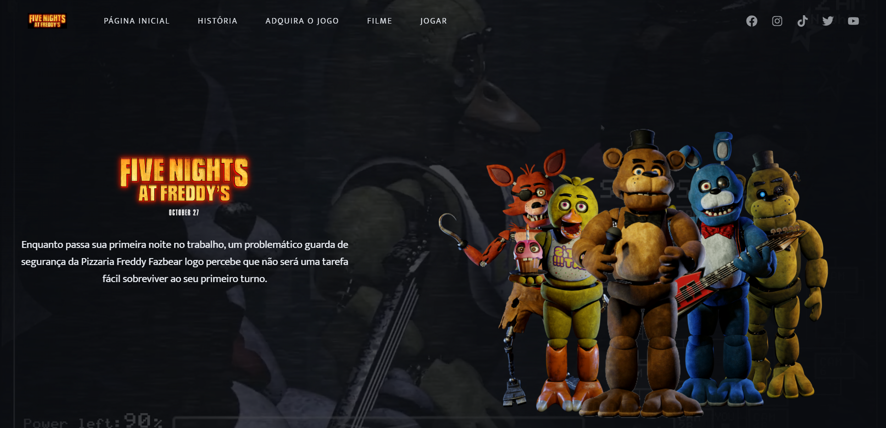

<h1 align="center">
  Site FNAF
</h1>

  

## 💻 Projeto
Bem vindos a minha fanpage do filme **FNAF**, cujo qual, possuo um grande apreço e admiração, pelo fato de sua história ter marcado minha adolescência. 
Este é o meu primeiro projeto pessoal, com intuito de medir, praticar, evoluir e demonstrar a evolução de meus conhecimentos de HTML, CSS e Javascript.

## 🚀 Tecnologias Utilizadas

- HTML
- CSS
- Javascript
- [AOS Animate](https://michalsnik.github.io/aos/)

## 📔 Conhecimentos abordados

- [x] Uso semântico do HTML;
- [x] Carregamento de video no background;
- [x] Váriaveis do css no `:root`;
- [x] Animações com a biblioteca [AOS](https://michalsnik.github.io/aos/);
- [x] Uso do CSS Flexbox;
- [x] Efeitos com a propriedade `transform` do css;
- [x] Adicionar efeito de hover nos botões;

## 🧠 Conhecimentos diferenciados adquiridos
- [x] Importação de Header e Footer em diversas páginas no HTML, através de JS;
- [x] Comandos de animações de fácil dominância, através da biblioteca AOS de MichalSnik;
